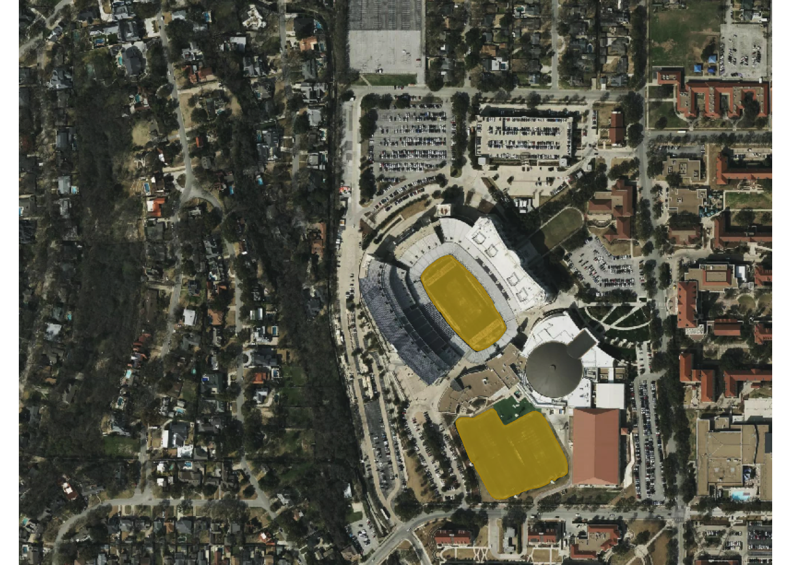
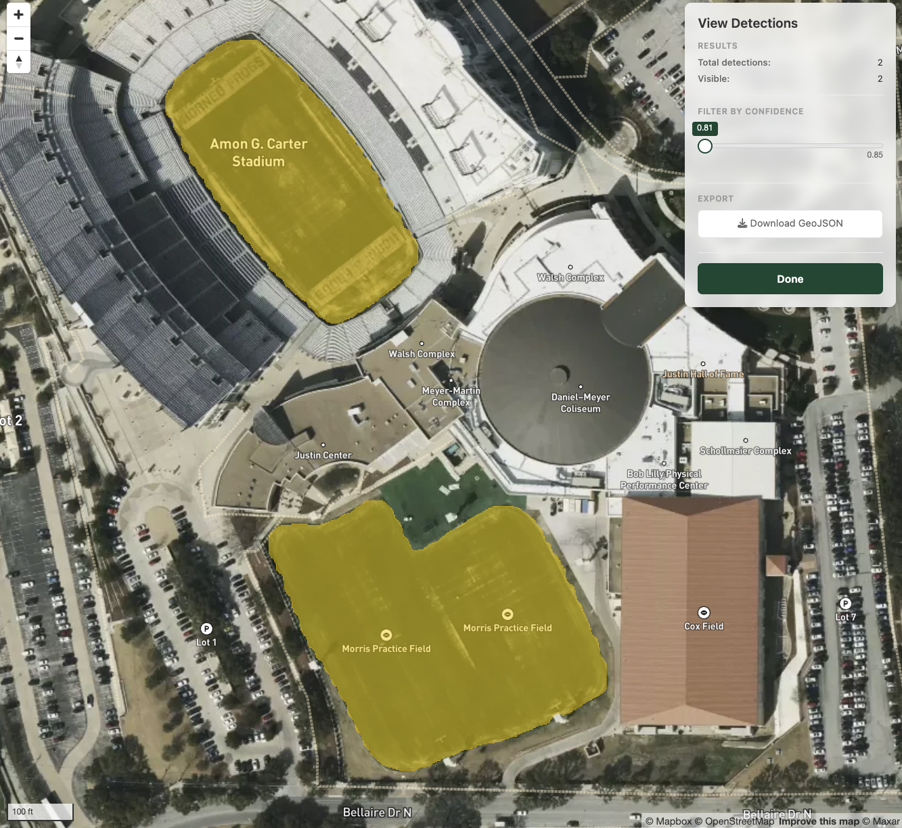

# Getting started with geosam

geosam provides an R interface to Meta’s Segment Anything Model 3 (SAM3)
for detecting objects in satellite imagery and photos. Unlike
traditional computer vision approaches, SAM3 lets you describe what
you’re looking for in plain text—no training data or model fine-tuning
required.

The package is inspired by the Python package
[segment-geospatial](https://samgeo.gishub.org/) by Qiusheng Wu, and
aims to bring similar functionality to R users. geosam offers an
R-native API, linking to packages such as terra for spatial workflows
and magick for image manipulation. It also includes tools for
interactive viewing and extraction with the mapgl R package.

### Installation

Getting set up with geosam takes a few steps. First, install from
R-Universe:

``` r

install.packages("geosam", repos = c("https://walkerke.r-universe.dev", "https://cloud.r-project.org"))
```

Or, install from source:

``` r

pak::pak("walkerke/geosam")
```

Once installed, load the package then set up a SAM3 Python environment
with
[`geosam_install()`](https://walker-data.com/geosam/reference/geosam_install.md).
By default, if run with no arguments,
[`geosam_install()`](https://walker-data.com/geosam/reference/geosam_install.md)
will use **uv** for the Python environment.

``` r

library(geosam)
geosam_install()
```

This creates a dedicated uv environment with PyTorch and HuggingFace
transformers.

If you prefer to use **venv** or **conda** for Python environment
management, you can supply the appropriate argument to
[`geosam_install()`](https://walker-data.com/geosam/reference/geosam_install.md):

``` r

geosam_install(method = "conda") # or method = "virtualenv"
```

This will set up a Python environment named `geosam` unless you supply
an alternative name to `envname`.

#### GPU acceleration

SAM3 runs significantly faster with GPU acceleration. If you have an
NVIDIA GPU with CUDA support, or an Apple Silicon Mac, geosam will
automatically detect and use it. GPU inference is typically 5-10x faster
than CPU, which makes a noticeable difference when processing larger
areas or multiple detections.

You can verify your GPU is being used with
[`geosam_status()`](https://walker-data.com/geosam/reference/geosam_status.md)
after installation—look for “MPS (Apple Silicon)” or “CUDA” in the
PyTorch status line.

### Authentication

geosam uses Meta’s SAM3 model hosted on HuggingFace, which requires
authentication and gated model access. You’ll need to complete two
steps: accept access terms for the model, and set up your access token.

#### Requesting SAM3 access

First, visit the [SAM3 model page on
HuggingFace](https://huggingface.co/facebook/sam3) and click “Request
access.” You’ll need a free HuggingFace account and you may be asked to
share contact information under the model’s gated access terms. Access
is typically granted quickly, but it is still required before geosam can
download the weights.

#### Setting up your access token

Once you have access, you’ll need a User Access Token. From your
HuggingFace account, go to **Settings \> Access Tokens** and create a
new token. A “read” token is sufficient for geosam since we’re only
downloading model weights—and read tokens are safer in case your token
is accidentally exposed.

The easiest way to authenticate is to save the token on your machine
using the HuggingFace CLI. From your terminal:

``` bash
huggingface-cli login
```

This saves your token to `~/.cache/huggingface/token`, where geosam will
find it automatically.

Alternatively, you can set the token as an environment variable in R.
For persistent use across sessions, add it to your `.Renviron` file:

``` r

# Open your .Renviron file
usethis::edit_r_environ()

# Add this line:
# HF_TOKEN=hf_xxxxx
```

Or set it for a single session:

``` r

Sys.setenv(HF_TOKEN = "hf_xxxxx")
```

#### Imagery API keys

For satellite imagery, geosam supports three providers. Mapbox offers
high-quality imagery but requires an API key:

``` r

Sys.setenv(MAPBOX_PUBLIC_TOKEN = "pk.xxxxx")
```

Esri World Imagery works without any API key, making it a good option
for getting started. MapTiler is also supported with the
`MAPTILER_API_KEY` environment variable.

### Check your setup

Before running your first detection, verify that everything is
configured correctly:

``` r

geosam_status()
```

    ── geosam Status ───────────────────────────────────────────────────────────────

    ℹ Environment: uv at /Users/kylewalker/.geosam/venvs/geosam

    ✔ Python: 3.12

    ℹ Path: /Users/kylewalker/.geosam/venvs/geosam/bin/python

    ✔ PyTorch 2.10.0: MPS (Apple Silicon)

    ✔ transformers: SAM3 classes available

    ✔ SAM3 tracker classes: available

    ✔ HuggingFace token: configured

    ── SAM3 HuggingFace Access ──

    ℹ SAM3 model cache: not found yet

    ✔ facebook/sam3 access: verified

This will show you the status of your Python environment, whether GPU
acceleration is available (MPS on Apple Silicon, CUDA on NVIDIA),
whether your HuggingFace token is configured, and whether that token can
access `facebook/sam3`. If everything shows green checkmarks, you’re
ready to go.

#### Troubleshooting conda installations

If you have multiple conda distributions installed (e.g., miniconda,
miniforge, anaconda), you may encounter errors like “conda environment
‘geosam’ not found” even when the environment exists. This happens
because R’s reticulate package may be looking in a different conda
installation than where your environment was created.

To diagnose the issue:

``` r

geosam_diagnose()
```

This will scan your system for all conda installations and geosam
environments, and provide recommendations. If your geosam environment is
in a different conda than reticulate’s default, you can specify which
conda to use:

``` r

# Use a specific conda installation (e.g., miniforge on Windows)
geosam_install(method = "conda", conda = "C:\\Users\\YourName\\miniforge3\\Scripts\\conda.exe")

# Or on macOS/Linux
geosam_install(method = "conda", conda = "~/miniforge3/bin/conda")
```

### Your first detection

Let’s detect football fields on the TCU campus in Fort Worth. The
[`sam_detect()`](https://walker-data.com/geosam/reference/sam_detect.md)
function is the main workhorse for satellite imagery detection. You
provide a bounding box, describe what you’re looking for with a text
prompt, and geosam handles the rest—downloading imagery, running SAM3
inference, and returning georeferenced results.

``` r

field <- sam_detect(
  bbox = c(-97.372, 32.707, -97.366, 32.712),
  text = "football field",
  source = "mapbox",
  zoom = 17
)
```

    ℹ Mapbox imagery is governed by the Mapbox Terms of Service.
      See: <https://www.mapbox.com/legal/tos/>
    ℹ Downloading Mapbox imagery at zoom 17...

    ℹ Fetching 12 tiles (4x3)...

    ✔ Saved imagery to: /var/folders/qm/xbtsglmj2ss91z9fzpz8k6q8ylngb5/T//RtmpuDkU0y/file453853f1b412.tif

    ℹ Large image (2048x1536). Processing in 6 chunks...

    ℹ Loading SAM3 model...

    ✔ SAM3 model loaded.

    Detecting objects [2/6]  33%

    Detecting objects [3/6]  50%

    Detecting objects [4/6]  67%

    Detecting objects [5/6]  83%

    Detecting objects [6/6] 100%

    ✔ Detected 2 objects across 6 chunks.

``` r

plot(field)
```



The `bbox` argument takes coordinates in WGS84 (longitude/latitude) as
`c(xmin, ymin, xmax, ymax)`. You can also pass an sf object and geosam
will extract its bounding box automatically.

The first time you run a detection, SAM3 will download model weights
from HuggingFace (about 2.5 GB). This only happens once as subsequent
runs use the cached model.

### Viewing results

Use [`sam_view()`](https://walker-data.com/geosam/reference/sam_view.md)
to explore your detections interactively:

``` r

sam_view(field)
```



This opens a Shiny application with the satellite imagery as a basemap
and your detections overlaid as polygons. You can adjust the confidence
threshold with a slider to filter out lower-quality detections, and
click on individual polygons to see their confidence scores. Here, we’ve
picked up the field inside the football stadium as well as the nearby
practice field.

Zoom out a bit for this view - you’ll see a white box representing the
extraction area. This is the area that we searched for features matching
the text prompt.

### Extracting polygons

When you’re ready to work with the results in R, extract them as an sf
object:

``` r

field_sf <- sam_as_sf(field)

field_sf
```

    Simple feature collection with 2 features and 2 fields
    Geometry type: POLYGON
    Dimension:     XY
    Bounding box:  xmin: -97.3687 ymin: 32.70723 xmax: -97.36657 ymax: 32.71022
    Geodetic CRS:  +proj=longlat +datum=WGS84 +no_defs
          score  area_m2                       geometry
    1 0.8820943 17306.76 POLYGON ((-97.36768 32.7083...
    2 0.8899280 11331.49 POLYGON ((-97.36831 32.7102...

The resulting sf object includes a `score` column with confidence values
(0–1) and an `area_m2` column with the area of each detection in square
meters. From here, you can filter, analyze, or export your detections
using standard sf workflows.

### Next steps

- [Satellite Imagery
  Detection](https://walker-data.com/geosam/articles/satellite-detection.md) -
  Full guide to geospatial workflows
- [Regular Image
  Detection](https://walker-data.com/geosam/articles/image-detection.md) -
  Working with photos and screenshots
- [Interactive
  Workflows](https://walker-data.com/geosam/articles/interactive.md) -
  Using the explore and view interfaces
