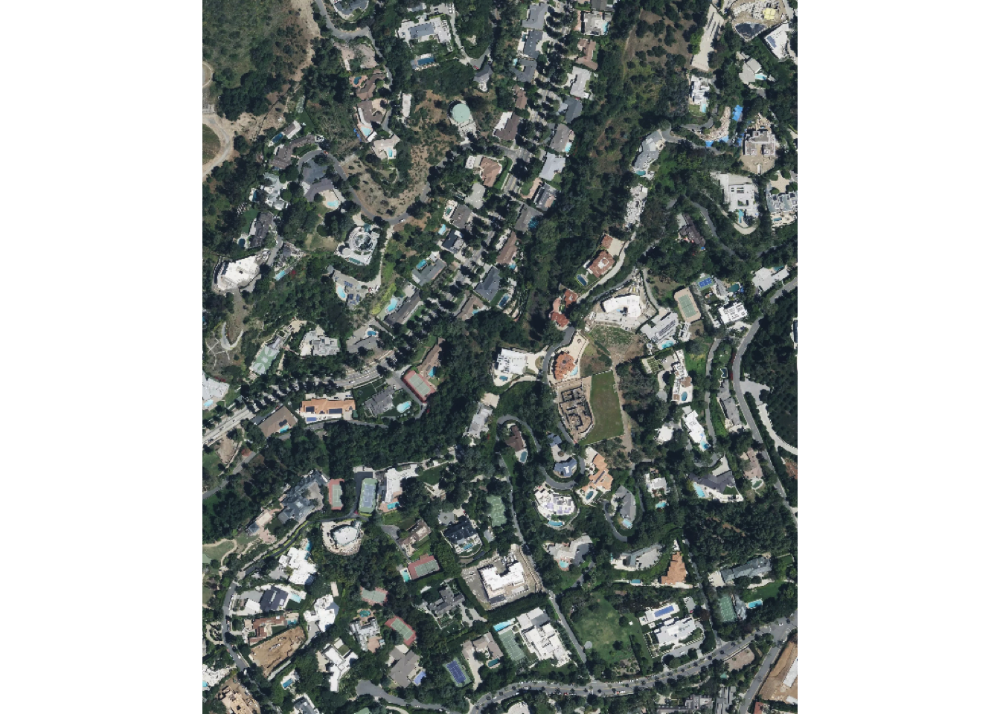
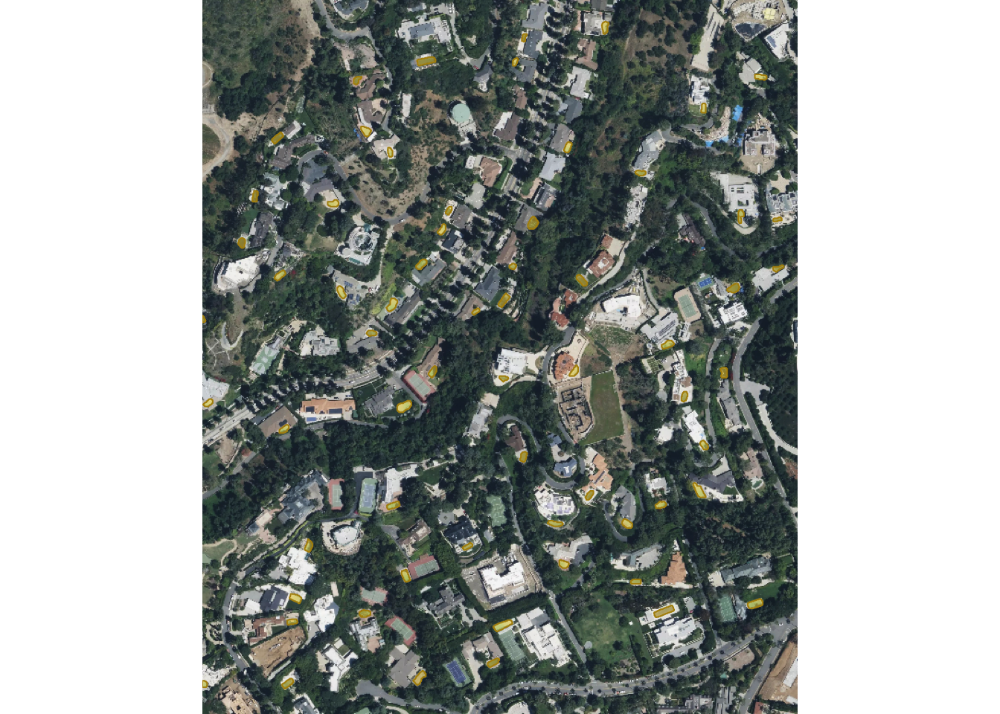
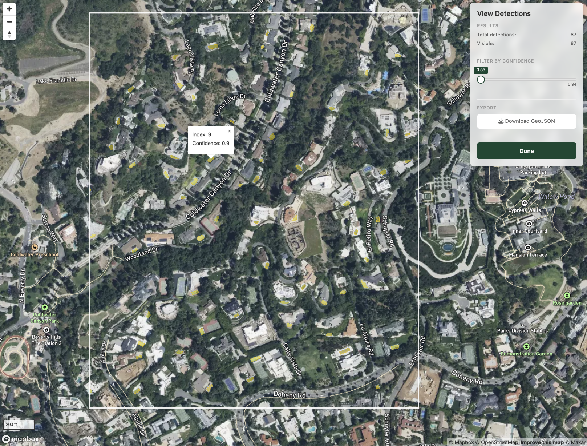
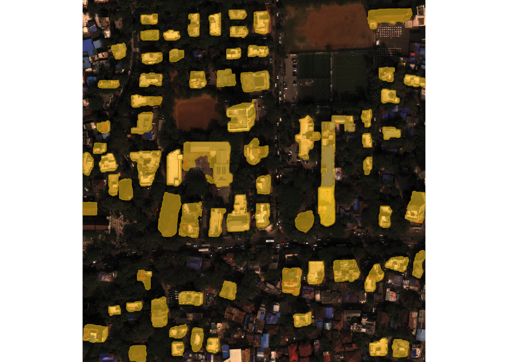
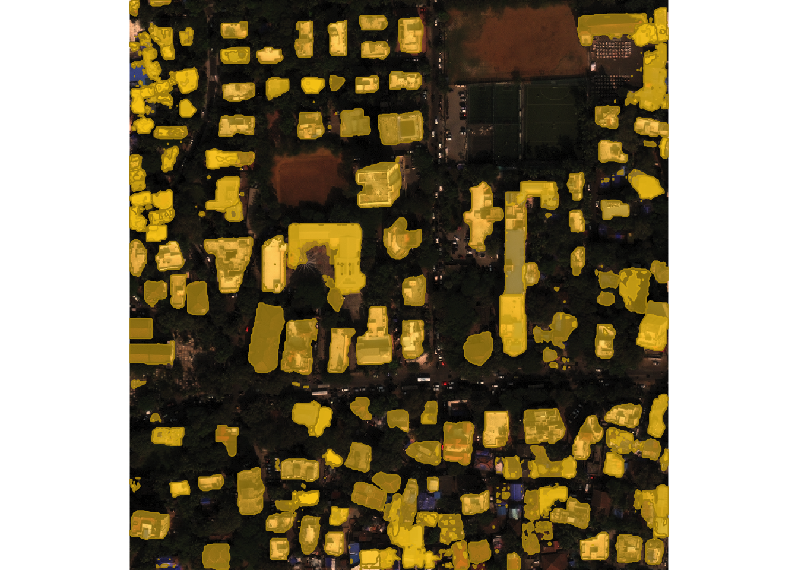
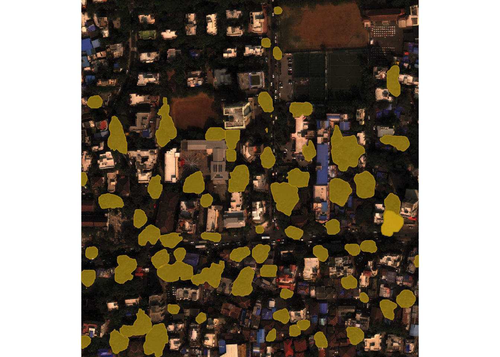
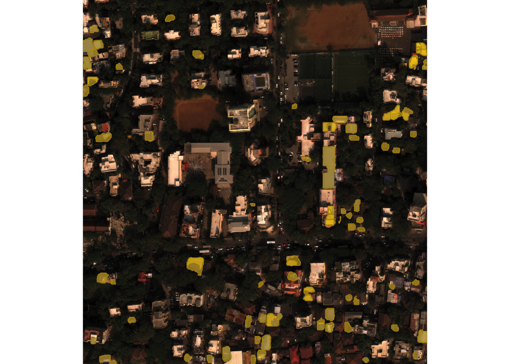

# Satellite imagery detection

With **geosam**, you can detect objects in satellite imagery using
natural language prompts. Describe what you’re looking for, and SAM3
returns georeferenced polygons.

The package hooks SAM3 into R’s geospatial infrastructure, using the
terra package for raster processing and mapgl for interactive
visualization. Let’s get started!

## Basic workflow

If you don’t have satellite imagery to use, you can download imagery
with geosam from Mapbox, Esri World Imagery, or MapTiler with the
[`get_imagery()`](https://walker-data.com/geosam/reference/get_imagery.md)
function. Let’s grab imagery from Mapbox for a section of Beverly Hills,
California:

``` r

library(geosam)

imagery <- get_imagery(
  bbox = c(-118.41, 34.09, -118.405, 34.095),
  source = "mapbox",
  zoom = 18
)

imagery
```

    [1] "/var/folders/qm/xbtsglmj2ss91z9fzpz8k6q8ylngb5/T//RtmpTwwYUP/file46465bdc5375.tif"

The zoom level will control the level of detail in the downloaded
imagery, with larger zooms resulting in higher resolution images. The
function returns a path to a GeoTIFF file containing the downloaded
imagery. We can plot it with the terra package:

``` r

library(terra)

plotRGB(rast(imagery))
```



You can use this GeoTIFF file as input to the
[`sam_detect()`](https://walker-data.com/geosam/reference/sam_detect.md)
function, or you can simply use
[`sam_detect()`](https://walker-data.com/geosam/reference/sam_detect.md)
to download satellite imagery and run detection in one step. Here we
find swimming pools in that section of Beverly Hills:

``` r

library(geosam)

pools <- sam_detect(
  bbox = c(-118.41, 34.09, -118.405, 34.095),
  text = "swimming pool",
  source = "mapbox",
  zoom = 18
)

pools
```

`pools` is an object of class `geosam` which represents the extraction
result.

To visualize the results of your extraction, use
[`plot()`](https://rspatial.github.io/terra/reference/plot.html):

``` r

plot(pools)
```



Plotting geosam objects will visualize the extracted polygons on the
original imagery. Here, we see the extracted pools visualized in yellow
over the Mapbox image.

For interactive exploration, use
[`sam_view()`](https://walker-data.com/geosam/reference/sam_view.md).
This launches a Shiny app where you can adjust the confidence threshold
with a slider, click polygons to see details, and export results as
GeoJSON:

``` r

sam_view(pools)
```

[`sam_view()`](https://walker-data.com/geosam/reference/sam_view.md)
launches a Shiny gadget that gives you an interactive view of your
extraction results. The viewer uses the same imagery source (Mapbox,
Esri, or MapTiler) as the detection, so results align with the basemap.
The white rectangle represents the area SAM3 scanned for extraction
results. Click any extracted object to view its index and confidence
score (0-1), filter your results by confidence score, and export your
result as GeoJSON if you’d like.



**Please note the terms of service for the satellite imagery
providers.** All providers allow for feature extraction from their
satellite imagery for non-commercial usage, so you can use this tool for
research or analysis purposes. You aren’t allowed to extract data from
their imagery and re-sell it. As geosam is MIT-licensed, you alone are
responsible for honoring these terms of service in your use of the
package.

## Bring your own imagery

If you have existing georeferenced satellite or aerial imagery, you can
pass the file path directly to use it in
[`sam_detect()`](https://walker-data.com/geosam/reference/sam_detect.md).
geosam bundles an imagery chip for Mumbai, India from the SpaceNet
dataset that you can experiment with. Let’s take a look at it.

``` r

# geosam includes a sample WorldView-3 chip from Mumbai (SpaceNet dataset)
mumbai <- system.file("extdata", "mumbai_chip.tif", package = "geosam")

buildings <- sam_detect(
  image = mumbai,
  text = "building"
)

plot(buildings)
```



[`sam_detect()`](https://walker-data.com/geosam/reference/sam_detect.md)
found 73 buildings, generally picking out discrete structures but
leaving out some of the more densely-packed areas. One reason for this
is because
[`sam_detect()`](https://walker-data.com/geosam/reference/sam_detect.md)
defaults to a confidence threshold of 0.5 in its extraction results. If
you want to be more generous with the extraction and return all results
found by SAM3, you can lower the threshold:

``` r

buildings_01 <- sam_detect(
  image = mumbai,
  text = "building",
  threshold = 0.1
)

plot(buildings_01)
```



175 objects are now detected, picking up most buildings in the view but
also returning some false positives.

Experiment with different types of prompts and see what you get back.
For example, we can look for trees in the image:

``` r

trees <- sam_detect(image = mumbai, text = "trees", threshold = 0.3)
plot(trees)
```



SAM3 also understands color, so you can segment your image by object
color as needed.  

``` r

blue_roofs <- sam_detect(image = mumbai, text = "blue roof", threshold = 0.2)
plot(blue_roofs)
```



## Extracting results

The function
[`sam_as_sf()`](https://walker-data.com/geosam/reference/sam_as_sf.md)
will convert an object of class `geosam` to an object of class `sf` for
use in spatial analysis workflows. Let’s convert our original buildings
object and see what we get back.

``` r

library(sf)

buildings_sf <- sam_as_sf(buildings)
buildings_sf
```

    Simple feature collection with 73 features and 3 fields
    Geometry type: GEOMETRY
    Dimension:     XY
    Bounding box:  xmin: 72.82462 ymin: 19.05357 xmax: 72.82827 ymax: 19.05713
    Geodetic CRS:  +proj=longlat +datum=WGS84 +no_defs
    First 10 features:
           score mask_id                       geometry  area_m2
    1  0.5029125       1 POLYGON ((72.82518 19.05373... 315.3316
    2  0.7437420       2 POLYGON ((72.82782 19.05632... 246.6490
    3  0.6988482       3 POLYGON ((72.82507 19.05541... 315.0516
    4  0.7671623       4 POLYGON ((72.82613 19.05438... 282.3758
    5  0.5511746       5 POLYGON ((72.82498 19.05641... 184.2481
    6  0.7723363       6 POLYGON ((72.82627 19.05674... 174.6477
    7  0.6467011       7 POLYGON ((72.82465 19.05568... 248.4039
    8  0.6462874       8 POLYGON ((72.82806 19.05647... 249.9719
    9  0.7299738       9 POLYGON ((72.82767 19.05611... 171.3253
    10 0.6914884      10 POLYGON ((72.82534 19.05692... 210.9247

The result includes polygon geometries, confidence scores, and area in
square meters. Use
[`sam_filter()`](https://walker-data.com/geosam/reference/sam_filter.md)
to filter by score or area before extraction:

``` r

filtered <- buildings |>
  sam_filter(min_area = 50, min_score = 0.6) |>
  sam_as_sf()

filtered
```

    Simple feature collection with 56 features and 3 fields
    Geometry type: GEOMETRY
    Dimension:     XY
    Bounding box:  xmin: 72.82462 ymin: 19.05357 xmax: 72.82827 ymax: 19.05712
    Geodetic CRS:  +proj=longlat +datum=WGS84 +no_defs
    First 10 features:
           score mask_id                       geometry  area_m2
    1  0.7437420       1 POLYGON ((72.82782 19.05632... 246.6490
    2  0.6988482       2 POLYGON ((72.82507 19.05541... 315.0516
    3  0.7671623       3 POLYGON ((72.82613 19.05438... 282.3758
    4  0.7723363       4 POLYGON ((72.82627 19.05674... 174.6477
    5  0.6467011       5 POLYGON ((72.82465 19.05568... 248.4039
    6  0.6462874       6 POLYGON ((72.82806 19.05647... 249.9719
    7  0.7299738       7 POLYGON ((72.82767 19.05611... 171.3253
    8  0.6914884       8 POLYGON ((72.82534 19.05692... 210.9247
    9  0.7627780       9 POLYGON ((72.82646 19.05582... 492.0996
    10 0.6257558      10 POLYGON ((72.82794 19.05379... 315.0546

With the sf object in hand, we can use our extracted results downstream
in R’s suite of spatial analysis and mapping packages. For example, we
can visualize our polygons interactively with the mapgl R package:

``` r

library(mapgl)

maplibre_view(buildings_sf)
```

We notice here that our extractions do not perfectly align with the
basemap; this is because our image source and the source of the basemap
building footprints are likely slightly different.

This reflects the advantage of using the built-in imagery pipelines with
this package as they are pulling directly from the map tiles providers
allowing for alignment on your interactive maps.
